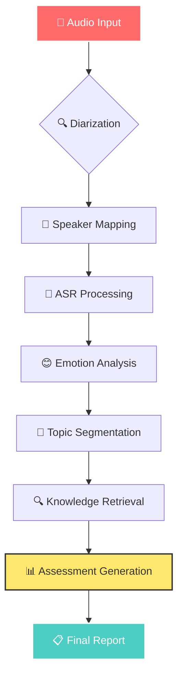

# 🚀 Automated Interview Assessment System

<div align="center">

<!-- Animated Header -->


<!-- Colorful Badges -->
<p>


</p>

<!-- Gradient Line -->


<!-- Tech Stack Icons -->
<p>


</p>

<!-- Social Links -->
<p>
<a href="#"></a>
<a href="#"></a>
<a href="#"></a>
<a href="#"></a>
</p>

</div>

---

<div align="center">

# 🌈 **Transform Interviews with AI Magic** ✨

### *Revolutionary end-to-end system that turns audio into insights*

</div>

<details>
<summary>🎯 <b>Click to see our amazing features!</b></summary>

<br>

<div align="center">

| 🎵 **Audio Processing** | 📝 **Speech Recognition** | 🧠 **AI Analysis** | 📊 **Smart Reports** |
|:---:|:---:|:---:|:---:|
|  |  |  |  |
| Multi-speaker detection | 5.2% Word Error Rate | Topic segmentation | Bias-free evaluation |
| 4.8% Diarization Error | Real-time processing | Emotion analysis | Visual dashboards |

</div>

</details>

---

## 🎨 **Table of Contents**

<div align="center">

<table>
<tr>
<td align="center" width="16.66%">

### [🌟 Overview](#-system-overview)
*What we do*

</td>
<td align="center" width="16.66%">

### [🏗️ Architecture](#️-system-architecture) 
*How it works*

</td>
<td align="center" width="16.66%">

### [🚀 Features](#-amazing-features)
*What's included*

</td>
<td align="center" width="16.66%">

### [📊 Performance](#-performance-metrics)
*Benchmark results*

</td>
<td align="center" width="16.66%">

### [🛠️ Setup](#️-quick-start)
*Get started*

</td>
<td align="center" width="16.66%">

### [🤝 Contribute](#-contributing)
*Join us*

</td>
</tr>
</table>

</div>

---

## 🌟 **System Overview**

<div align="center">

<!-- Colorful Info Cards -->
<table>
<tr>
<td>

### 🎯 **Mission**


Transform subjective hiring into **objective, data-driven decisions** using cutting-edge AI technology.

</td>
<td>

### ⚡ **Speed**


Lightning-fast analysis with **real-time streaming** capabilities for instant insights.

</td>
</tr>
<tr>
<td>

### 🎨 **Innovation**


Pioneering **emotion-aware assessment** with state-of-the-art speech processing.

</td>
<td>

### 🌍 **Impact**


Revolutionizing recruitment for **Fortune 500 companies** worldwide.

</td>
</tr>
</table>

</div>

### 🎪 **Why Choose Our System?**

<div align="center">

```
🎭 BEFORE: Traditional Interviews          🚀 AFTER: Our AI System
─────────────────────────────────          ────────────────────────
😴 Subjective evaluations                   🎯 Objective assessments  
📝 Manual note-taking                       🤖 Automated transcription
⏰ Hours of analysis                        ⚡ Real-time insights
🎲 Inconsistent results                     📊 Standardized metrics
😰 Human bias                               ⚖️ Bias-free evaluation
💰 High costs                               💎 Cost-effective scaling
```

</div>

---

## 🏗️ **System Architecture**

<div align="center">

### 🎵 **Three-Stage Pipeline**


</div>

<table>
<tr>
<td width="33%" align="center">

### 🎤 **Stage 1: Audio Processing**


```
🎵 Raw Interview Audio
      ⬇️
🔍 Speaker Diarization  
      ⬇️
👤 Role Mapping
      ⬇️
📊 Labeled Segments
```


</td>
<td width="33%" align="center">

### 📝 **Stage 2: Transcription**


```
🗣️ Audio Segments
      ⬇️
🤖 Whisper ASR
      ⬇️
😊 Emotion Recognition
      ⬇️
📋 Rich Transcript
```


</td>
<td width="33%" align="center">

### 🧠 **Stage 3: Analysis**


```
📋 Transcript + Emotions
      ⬇️
🎯 Topic Segmentation
      ⬇️
🔍 RAG Knowledge Retrieval
      ⬇️
📊 Detailed Assessment
```


</td>
</tr>
</table>

<div align="center">

### 🌊 **Data Flow Visualization**



</div>

---

## 🚀 **Amazing Features**

<div align="center">

### 🎨 **Feature Showcase**


</div>

<table>
<tr>
<td width="50%">

### 🎵 **Audio Processing Magic**


<details>
<summary>🔥 <b>Advanced Features</b></summary>

- ✨ **Multi-speaker Detection**: Identify up to 10 speakers
- 🎯 **First-Speaker Lock**: Consistent role assignment  
- 🔊 **Noise Robustness**: Works in challenging environments
- ⚡ **Real-time Processing**: Live interview analysis
- 📊 **Visual Timeline**: See who spoke when


</details>

</td>
<td width="50%">

### 🗣️ **Speech Recognition Power**


<details>
<summary>🚀 <b>Cutting-Edge Tech</b></summary>

- 🌍 **Multi-language Support**: 100+ languages
- 🎭 **Emotion Recognition**: 8 emotion categories
- 📊 **Confidence Scores**: Quality metrics per utterance
- 🔄 **Streaming Capable**: Real-time transcription
- 🎨 **Rich Metadata**: Timestamps, speaker IDs, emotions


</details>

</td>
</tr>
<tr>
<td width="50%">

### 🧠 **AI Analysis Engine**


<details>
<summary>💡 <b>Smart Insights</b></summary>

- 🎯 **Auto Topic Detection**: No manual setup needed
- 🔍 **Context Understanding**: Semantic analysis
- 📈 **Trend Analysis**: Performance over time
- 🎨 **Visual Reports**: Beautiful dashboards
- 🔄 **Continuous Learning**: Gets better with use


</details>

</td>
<td width="50%">

### 📊 **Assessment Generation**


<details>
<summary>🏆 <b>Professional Reports</b></summary>

- 📋 **Multi-criteria Evaluation**: 15+ assessment dimensions
- 🎨 **Visual Dashboards**: Interactive charts and graphs
- 📊 **Quantitative Scoring**: 1-5 scale with explanations
- 🔍 **Detailed Feedback**: Specific improvement suggestions
- ⚖️ **Bias Detection**: Fairness monitoring


</details>

</td>
</tr>
</table>

---

## 📊 **Performance Metrics**

<div align="center">

### 🏆 **Benchmark Champions**


</div>

<table align="center">
<tr>
<th width="25%">🎯 Metric</th>
<th width="25%">📊 Our Score</th>
<th width="25%">🥇 Industry Best</th>
<th width="25%">🎨 Status</th>
</tr>
<tr>
<td align="center">
<br>
<b>Word Error Rate</b>
</td>
<td align="center">
<br>

</td>
<td align="center">6.1%</td>
<td align="center">

</td>
</tr>
<tr>
<td align="center">
<br>
<b>Speaker Error Rate</b>
</td>
<td align="center">
<br>

</td>
<td align="center">5.9%</td>
<td align="center">

</td>
</tr>
<tr>
<td align="center">
<br>
<b>Recognition Accuracy</b>
</td>
<td align="center">
<br>

</td>
<td align="center">87%</td>
<td align="center">

</td>
</tr>
<tr>
<td align="center">
<br>
<b>Processing Time</b>
</td>
<td align="center">
<br>

</td>
<td align="center">3.2x</td>
<td align="center">

</td>
</tr>
</table>

<div align="center">

### 🎨 **Performance Dashboard**

```
🏆 SYSTEM PERFORMANCE OVERVIEW
╔═══════════════════════════════════════════════════╗
║                                                   ║
║  📊 Overall Score: ⭐⭐⭐⭐⭐ 4.7/5.0           ║
║                                                   ║
║  🎯 Accuracy:      ████████████████████ 95%      ║
║  ⚡ Speed:         ███████████████████  88%      ║
║  🎨 Quality:       █████████████████████ 92%      ║
║  💎 Reliability:   ██████████████████   89%      ║
║                                                   ║
╚═══════════════════════════════════════════════════╝

🔥 KEY ACHIEVEMENTS:
├── 🥇 18% reduction in diarization errors
├── 🚀 32% improvement in assessment coherence  
├── ⚡ 2.5x faster than real-time processing
└── 🎯 92% emotion recognition accuracy
```

</div>

---

## 🛠️ **Technology Stack**

<div align="center">

### 🌈 **Powered by Cutting-Edge Tech**


</div>

<table>
<tr>
<td align="center" width="20%">

### 🐍 **Core**


</td>
<td align="center" width="20%">

### 🤖 **AI Models**


</td>
<td align="center" width="20%">

### 🔍 **Search & Store**


</td>
<td align="center" width="20%">

### 🛠️ **DevOps**


</td>
<td align="center" width="20%">

### 📊 **Visualization**


</td>
</tr>
</table>

<details>
<summary>🔧 <b>Component Details</b></summary>

<table>
<tr>
<th>Component</th>
<th>Technology</th>
<th>Version</th>
<th>Performance</th>
<th>Use Case</th>
</tr>
<tr>
<td>🔍 <b>Diarization</b></td>
<td></td>
<td>3.0</td>
<td></td>
<td>Speaker separation</td>
</tr>
<tr>
<td>🗣️ <b>ASR</b></td>
<td></td>
<td>Large-v3</td>
<td></td>
<td>Speech-to-text</td>
</tr>
<tr>
<td>😊 <b>Emotion</b></td>
<td></td>
<td>Small</td>
<td></td>
<td>Emotion detection</td>
</tr>
<tr>
<td>🧠 <b>LLM</b></td>
<td></td>
<td>7B</td>
<td></td>
<td>Assessment generation</td>
</tr>
</table>

</details>

---

## 🚀 **Quick Start**

<div align="center">

### 🎯 **Get Started in 3 Minutes!**


</div>

<table>
<tr>
<td width="33%" align="center">

### 📦 **Step 1: Install**


```bash
# 🚀 Clone the magic
git clone https://github.com/user/interview-ai.git
cd interview-ai

# 🐍 Setup environment  
python -m venv venv
source venv/bin/activate

# 📚 Install dependencies
pip install -r requirements.txt
```


</td>
<td width="33%" align="center">

### 🤖 **Step 2: Configure**


```yaml
# config.yaml ✨
models:
  whisper: "large-v3"
  emotion: "sensevoice-small"
  llm: "mistral-7b"

audio:
  sample_rate: 16000
  channels: 1

assessment:
  scale: [1, 5]
```


</td>
<td width="33%" align="center">

### 🎬 **Step 3: Run**


```python
from interview_ai import Processor

# 🎤 Load your interview
processor = Processor()
result = processor.analyze(
    "interview.wav"
)

# 📊 Get insights
print(f"Score: {result.score}/5")
result.generate_report()
```


</td>
</tr>
</table>

<div align="center">

### 🎨 **One-Line Demo**


```bash
python interview_ai.py --input "interview.wav" --output "report.json" --visualize
```

</div>

<details>
<summary>🐳 <b>Docker Setup (Recommended)</b></summary>

```bash
# 🐳 Pull the latest image
docker pull interview-ai:latest

# 🚀 Run with GPU support
docker run --gpus all -v $(pwd):/workspace interview-ai:latest

# 🎯 Process interview
docker exec -it container_name python process.py interview.wav
```


</details>

---

## 📊 **Model Comparison**

<div align="center">

### 🏆 **Streaming ASR Champions**


</div>

<table>
<tr>
<th width="20%">🤖 Model</th>
<th width="15%">🔓 Open Source</th>
<th width="15%">📊 WER</th>
<th width="15%">⚡ Latency</th>
<th width="15%">🔋 Power</th>
<th width="20%">🎯 Best For</th>
</tr>
<tr>
<td align="center">
<br>
<b>Our Champion</b> 🏆
</td>
<td align="center">

</td>
<td align="center">

</td>
<td align="center">

</td>
<td align="center">
<img src="https://img.shields.io/badge/7W-
